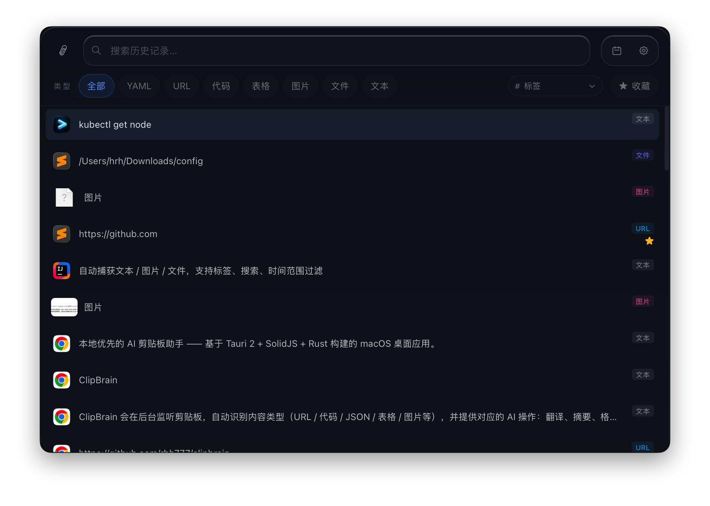
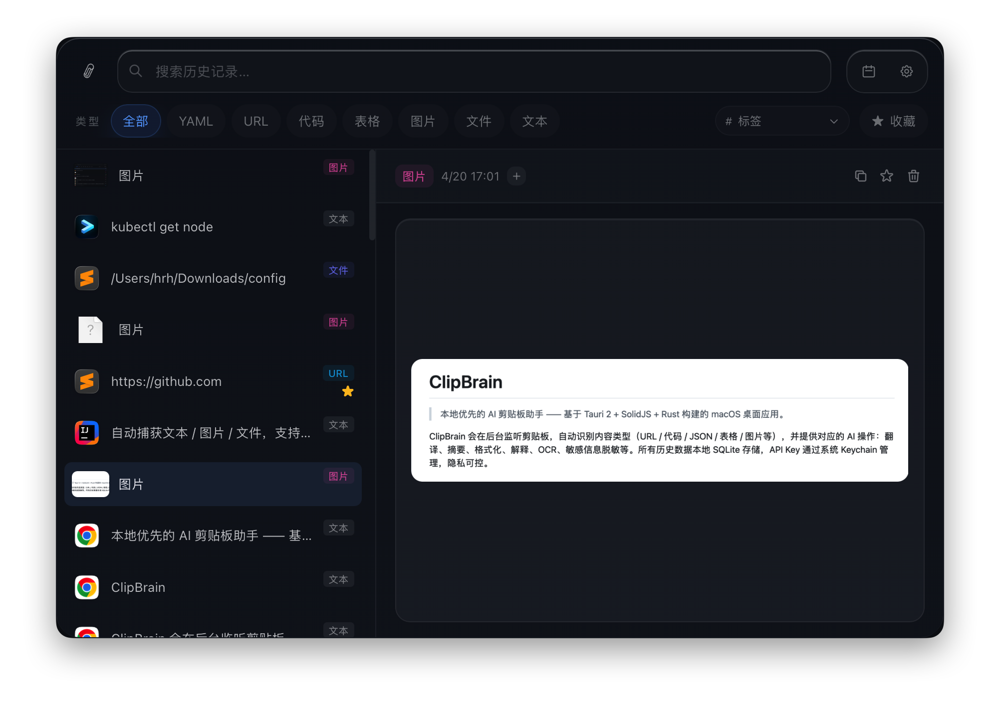

# ClipBrain

> 本地优先的 AI 剪贴板助手 —— 基于 Tauri 2 + SolidJS + Rust 构建的 macOS 桌面应用。

ClipBrain 会在后台监听剪贴板，自动识别内容类型（URL / 代码 / JSON / 表格 / 图片等），并提供对应的处理动作：翻译、摘要、格式化、解释、敏感信息脱敏等；在配置支持视觉的 OpenAI-compatible 模型后，还可对图片执行 OCR、图片描述，以及围绕图片内容发起自定义问答。所有历史数据本地 SQLite 存储，API Key 通过系统 Keychain 管理，隐私可控。

<p align="center">
  
</p>
<p align="center">
  
</p>

## 特性

- **剪贴板历史**：自动捕获文本 / 图片 / 文件，支持标签、搜索、时间范围过滤
- **智能分类**：基于规则 + 可选 LLM 识别内容类型
- **AI 动作**：内置 URL 预览、JSON/YAML 格式化、数学计算、Markdown 表格互转、敏感字段脱敏、LLM 文本处理；图片项在配置视觉模型后支持 OCR、图片描述和自定义图片问答
- **插件化动作**：支持通过 `plugin.toml` + Prompt 声明自定义 AI 动作
- **模型接入**：当前通过 OpenAI-compatible 接口接入远程或本地模型服务（如 OpenAI 兼容网关、Ollama 等）
- **macOS 原生 NSPanel**：覆盖式悬浮面板，无焦点切换、无 Dock 图标干扰
- **全局快捷键**：一键唤起，支持自定义
- **隐私优先**：默认本地处理；发往远程模型前可配置脱敏规则

## 技术栈

| 层 | 技术 |
|---|---|
| 桌面壳 | [Tauri 2](https://tauri.app/) |
| 前端 | [SolidJS](https://www.solidjs.com/) + TypeScript + [TailwindCSS 4](https://tailwindcss.com/) |
| 后端 | Rust + Tokio + rusqlite + reqwest |
| 平台 | macOS（已适配 NSPanel，其他平台需额外适配） |

## 快速开始

### 环境要求

- macOS 12+
- Node.js 18+
- Rust 1.75+（通过 [rustup](https://rustup.rs/) 安装）
- Xcode Command Line Tools

### 安装与运行

```bash
# 安装前端依赖
npm install

# 开发模式（自动启动前端 + Rust 后端）
npm run tauri dev

# 生产构建（输出 .app / .dmg 到 src-tauri/target/release/bundle/）
npm run tauri build
```

首次启动会进入引导页，配置好模型 API Key 后即可使用。API Key 存储于系统 Keychain，不会写入任何文件。

## 项目结构

```
clipbrain/
├── src/                    # SolidJS 前端
│   ├── components/         # 组件（MainLayout / ClipboardPanel / DetailPanel / SettingsPage 等）
│   ├── lib/                # IPC / i18n / 主题
│   ├── locales/            # 多语言
│   └── App.tsx             # 页面路由
├── src-tauri/              # Rust 后端
│   ├── src/
│   │   ├── actions/        # AI 动作（内置 + 插件）
│   │   ├── classifier/     # 内容类型识别
│   │   ├── clipboard/      # 剪贴板监听
│   │   ├── commands/       # Tauri IPC 命令
│   │   ├── config/         # 配置 + 隐私规则
│   │   ├── model/          # LLM 后端抽象（本地 + 远程）
│   │   ├── storage/        # SQLite 持久化
│   │   ├── macos_panel.rs  # macOS NSPanel 集成
│   │   └── lib.rs          # 入口
│   ├── Cargo.toml
│   └── tauri.conf.json
├── index.html
├── package.json
└── vite.config.ts
```

## 贡献

欢迎 Issue / PR。提交前请确保：

- `npm run tauri build` 构建通过
- Rust 端 `cargo clippy` 无新增警告
- 提交信息遵循 [Conventional Commits](https://www.conventionalcommits.org/)

## 许可证

[MIT](./LICENSE) © 2026 rhh777
